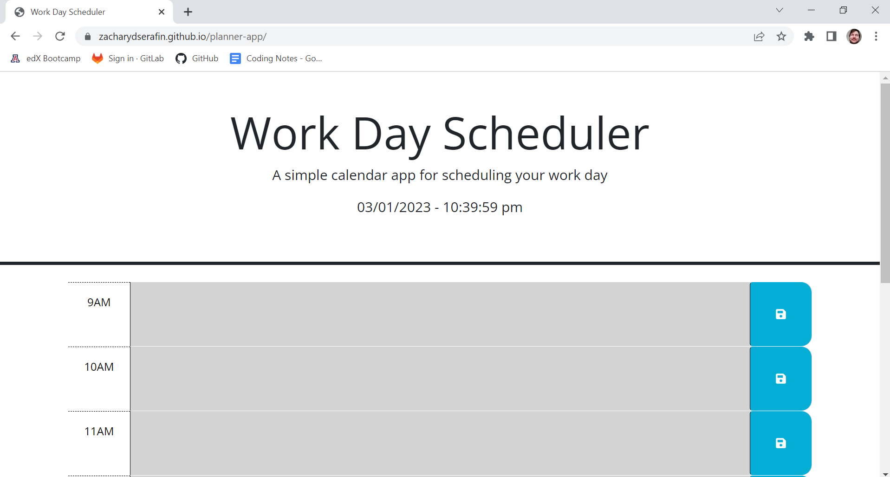

# University of Arizona Coding Boot Camp: Project Five - Planner

*Challenge 05 - Utilizing skills we learned in "Module 5: Third Party APIs"*

## Description

The goal of Project (or Challenge) Five was to add functionality to a day planning website. The requirements included having timeblocks for a standard work day, where those timeblocks are color-coded to match whether they are in the past, present, or future. The date and time also needed to be listed at the top of the page. Finally, any changes made in the textbox areas of the timeblocks needed to be able to be saved to local storage and retrieved/populated on a page reload.

## Screenshot

## Links

*Link to deployed webpage:* https://zacharydserafin.github.io/planner-app/

*Link to GitHub repository:* https://github.com/zacharydserafin/planner-app

## Credits

*University of Arizona Coding Bootcamp (Powered by edX)*: provided the source code for the HTML and the CSS stylesheet.
